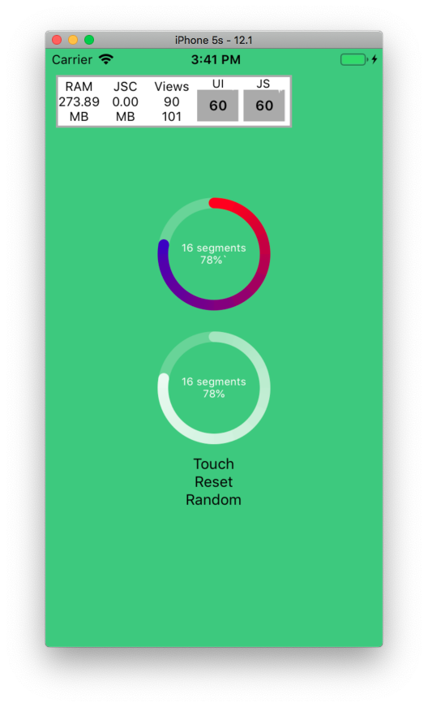

# rn-conical-gradient-progress

:pencil2: Attempt to fix the following error in latest RN version.

:bangbang: Invariant Violation: ViewPropTypes has been removed from React Native. Migrate to ViewPropTypes exported from 'deprecated-react-native-prop-types'

## Installation
Install this component and `react-native-svg`:

`npm i --save rn-conical-gradient-progress react-native-svg`

Link native code for SVG:

`react-native link react-native-svg`

## Description
- Can accept external Props `size,
  width,
  fill,
  prefill,
  beginColor,
  endColor,
  segments,
  backgroundColor`
- Migrated to `expo`
- Migrated to `react-native-svg`
- Used multiple paths and different linear gradients to implement the conical gradient

## Todo
- [ ] Customize component
- [ ] Some performance tricks
- [x] Accept Component Props
- [x] Move to Expo 

## Status

## References
- https://github.com/bgryszko/react-native-circular-progress/issues/41
- https://github.com/fdnhkj/react-native-conical-gradient
- https://github.com/bgryszko/react-native-circular
- http://jsfiddle.net/Cy7ec/3/
- https://github.com/fdnhkj/react-native-conical-gradient
